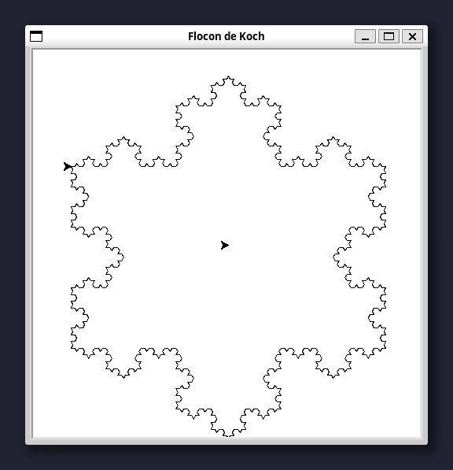

# Datamodel Python

Durant ce cours, nous avons vu les bases du langage Python, durant ces 16 semaines nous avons abordé l'écosystème de Python, ses modules, ses librairies, ses outils, ses bonnes pratiques, etc.

Pour parfaire vos connaissances, je vous propose de vous plonger dans la documentation officielle de Python, qui est une mine d'or pour tout développeur Python.

Le *Data model* est une partie de la documentation qui est très intéressante à lire. Elle n'est pas très digeste pour un débutant, mais adopter le reflexe de s'y référer est une bonne habitude à prendre.

Pour ce travail pratique, nous allons plonger dans le *Data model* de Python accessible [ici](https://docs.python.org/3/reference/datamodel.html).

## Types particuliers

### None

Le type [None](https://docs.python.org/3/reference/datamodel.html#none) est une instance unique de `NoneType` qui est souvent utilisé pour représenter l'absence de valeur. Il est retourné par des fonctions qui ne retournent pas explicitement de valeur. C'est la valeur par défaut de retour des fonctions:

```python
def foo():
    pass

u = foo()
```

Quel est le type de `u` ?

> [!TIP]
> Pour afficher le type d'une variable, vous pouvez utiliser la fonction `type()`.

Vous allez obtenir la valeur `NoneType` qui est la classe de l'objet `None`. Comme pour tous les objets Python, le type d'une classe, y-compris `NoneType`, est `type`

```python
>>> type(type(None))
type
```

### Ellipse

L'objet [Ellipse](https://docs.python.org/3/reference/datamodel.html#Ellipsis) est une instance unique de la classe `ellipsis`. Il est utilisé pour indiquer une opération en cours ou une valeur par défaut dans les slices.

Sa représentation littérale est `...`.

On peut l'utiliser dans plusieurs cas de figure:

L'`Ellipsis` en Python est représenté par les trois points de suspension (`...`). Bien que son utilisation ne soit pas très courante, il existe plusieurs cas où l'`Ellipsis` peut être utile :

1. **Indicateur de code incomplet ou à compléter plus tard :**
   L'`Ellipsis` peut être utilisé comme un espace réservé pour indiquer que du code doit être ajouté à cet endroit ultérieurement. C'est souvent utilisé lors du développement ou du prototypage rapide.

   ```python
   def function_to_be_implemented_later():
       ...
   ```

2. **Slicing avancé avec Numpy :**
   L'`Ellipsis` est particulièrement utile avec les bibliothèques comme NumPy pour représenter plusieurs tranches. Il peut être utilisé pour sélectionner des sous-ensembles de tableaux de manière concise.

   ```python
   import numpy as np
   array = np.random.rand(4, 3, 2)
   print(array[..., 1])  # Sélectionne la dernière dimension
   ```

3. **Méthodes et classes abstraites :**
   Lors de la définition de classes et de méthodes abstraites, l'`Ellipsis` peut être utilisé pour marquer une méthode comme abstraite, indiquant que la méthode doit être implémentée dans une sous-classe.

   ```python
   class AbstractClass:
       def abstract_method(self):
           ...
   ```

4. **Annotations de type (typing) :**
   Dans certains cas, l'`Ellipsis` peut être utilisé avec des annotations de type pour indiquer que le type est générique ou indéterminé.

   ```python
   from typing import Any

   def func_with_unknown_args(*args: Any, **kwargs: Any) -> None:
       ...
   ```

5. **Marquer des passages de code ignorés dans les blocs `if __name__ == "__main__"` :**

   L'`Ellipsis` peut être utilisé pour marquer des parties de code ignorées dans des blocs conditionnels pour des tests ou des scripts exécutés directement.

   ```python
   if __name__ == "__main__":
       ...
   ```

6. **Désignation d'un indice complet dans des objets personnalisés :**
   Lors de la définition de classes personnalisées qui implémentent la méthode `__getitem__`, l'`Ellipsis` peut être utilisé pour désigner des indices complets ou des comportements spécifiques.

   ```python
   class MyClass:
       def __getitem__(self, key):
           if key == ...:
               return "Ellipsis used"
           else:
               return "Key used"

   obj = MyClass()
   print(obj[...])  # Affiche "Ellipsis used"
   ```

Ces cas montrent la polyvalence de l'`Ellipsis` en Python, même si son utilisation reste relativement rare par rapport à d'autres éléments du langage.

## Séquences immuables

Nous l'avons vu durant le cours certains objets complexes comme les listes ou les dictionnaires ne peuvent pas être hachés, c'est-à-dire qu'ils ne peuvent pas être utilisés comme clés dans un dictionnaire ou stockés dans un ensemble.

Vous ne pouvez pas faire `hash({})` ou `hash([])`.

Ceci nous amène à la notion de séquences immuables. Les séquences immuables sont des objets qui ne peuvent pas être modifiés après leur création. Les types de séquences immuables les plus courants en Python sont:

1. les chaînes de caractères,
2. les tuples et
3. les `frozenset`.

Lorsque vous ajouter un caractère à une chaîne de caractères, Python crée une nouvelle chaîne de caractères. En voici la preuve :

```python
>>> s = "hello"
>>> hex(id(s))
'0x7f8b1c1b3b70'
>>> s += " world"  # On s'attend à juste étendre la chaîne de caractères
>>> hex(id(s))  # Mais on obtient une nouvelle adresse mémoire
'0x7f7849c9e7f0'
```

## Le garbage collector

On peut se demander ce qui se passe de l'ancienne valeur de `s` ? Python est un langage de programmation qui gère la mémoire de manière automatique. Lorsque la variable `s` est réaffectée, Python libère automatiquement la mémoire de l'ancienne valeur de `s` qui n'est plus utilisée.

Le système utilisé par Python pour gérer la mémoire est appelé *garbage collector*. Le garbage collector est un processus qui s'exécute en arrière-plan et qui est responsable de la libération de la mémoire des objets qui ne sont plus utilisés par le programme.

La fonction `sys.getrefcount()` permet de connaître le nombre de références d'un objet. Par exemple, si on exécute `sys.getrefcount(s)` après la réaffectation de `s`, on obtient 2. Cela signifie que `s` est référencé par deux variables. Notons que `sys.getrefcount()` renvoie toujours un nombre supérieur ou égal au nombre réel de références puisqu'il en crée une temporaire pour l'appel de la fonction.

D'après vous quel est le nombre de référence à la variable `v` ?

```python
v = 1
u = [v, v, v, v, v]
```

> [!TIP]
> Pour afficher le nombre de références d'une variable, vous pouvez utiliser la fonction `sys.getrefcount()` et importer le module `sys`.

Lorsque le nombre de référence sur un objet tombe à zéro, le garbage collector libère la mémoire de cet objet, c'est-à-dire qu'il le détruit. En C on utiliserait la fonction `free()` pour libérer la mémoire allouée à un objet.

Ceci nous amène à penser que Python ne fonctionne qu'avec de l'allocation dynamique de mémoire. La plupart des objets sont alloués sur le `heap`, en C ce serait l'équivalent de l'allocation dynamique de mémoire avec `malloc()`.

## Les Callables

Expliqué [ici](https://docs.python.org/3/reference/datamodel.html#callable-types), un objet est dit *callable* s'il peut être appelé comme une fonction. Pour vérifier si un objet est *callable*, on peut utiliser la fonction `callable()`.

```python
def foo():
    pass

assert callable(foo) == True
```

Un objet appelable défini certains attributs spéciaux:

- `__call__()` : une méthode qui sera appelée lorsqu'on appelle l'objet.
- `__defaults__` : les valeurs par défaut des arguments de la fonction.
- `__doc__` : la documentation de la fonction.

```python
def add(a, b=42):
    """ Add two numbers """
    return a + b

assert add.__doc__ == " Add two numbers "
assert add.__defaults__ == (42,)
```

On peut évidemment appeler la fonction `add` de la manière suivante:

```python
add.__call__(1, 2)
```

N'oubliez pas que Python est un langage reflexif, c'est-à-dire qu'il permet de manipuler les objets comme des objets de première classe. C'est pour cela que l'on peut manipuler les fonctions comme des objets. On peut même obtenir le code source d'une fonction en utilisant la fonction `inspect.getsource()`.

Essayez de récupérer le code source de la fonction `add` en utilisant la fonction `inspect.getsource()`.

## Les objets

On sait que les objets en Python sont des instances de classes. On sait également qu'un tas de méthodes spéciales permettent de définir le comportement d'un objet. Par exemple, la méthode `__str__()` permet de définir la représentation d'un objet sous forme de chaîne de caractères.

Il y a deux méthodes qui sont difficiles à comprendre c'est le `__init__()` et le `__new__()`. Le `__new__()` est une méthode statique qui est appelée avant le `__init__()` et qui est responsable de la création de l'objet.

### `__new__`

Dans un langage objet comme C++ ou Java on parle de *constructeur* pour désigner la méthode qui est appelée lors de la création d'un objet. En Python, le `__new__()` est le constructeur de la classe.

Il est rare de devoir utiliser le `__new__()` dans une classe à moins d'avoir recours à des besoins très spécifiques.

Un cas typique est le Singleton. Le Singleton est un patron de conception utilisé en génie logiciel. Il garantit qu'une classe n'a qu'une seule instance et fournit un point d'accès global à cette instance.

Le Singleton est utilisé par exemple pour faire du logging, ou pour gérer des configurations globales d'un projet.

L'exemple le plus courant est:

```python
import logging

logger = logging.getLogger(__name__)
```

Ici on demande au module de logging de nous retourner un objet `Logger` qui est unique pour le module courant, c'est un Singleton.

Voici l'exemple d'un Singleton qui est un compteur unique:

```python
class CounterSingleton:
    _instance = None

    def __new__(cls):
        if cls._instance is None:
            cls._instance = super(CounterSingleton, cls).__new__(cls)
            cls._instance.counter = 0
        return cls._instance

    def increment(self):
        self.counter += 1

    def __int__(self):
        return self.counter

    def value(self):
        return self.counter
```

On peut utiliser ce Singleton de la manière suivante:

```python
s1 = CounterSingleton()
s1.increment()
a = s1.value() # a = 1

s2 = CounterSingleton()
s2.increment()
b = s2.value() # b = 2

def fonction():
    s3 = CounterSingleton()
    s3.increment()
    return s3.value()

c = fonction() # c = 3
```

Ici le `__new__` assigne l'instance à un attribut caché de classe `_instance`. Si l'instance n'existe pas, on crée une nouvelle instance de la classe `CounterSingleton` et on l'assigne à l'attribut `_instance`.

Si l'on souhaite hériter d'une classe immuable comme `int`, on doit surcharger le `__new__()` et non le `__init__()`.

```python
class MyInt(int):
    def __new__(cls, value):
        return super(MyInt, cls).__new__(cls, value)

    def __init__(self, value):
        super(MyInt, self).__init__()
        self.value = value

    def add_answer_to_everything(self):
        return self + 42

i = MyInt(42)
assert isinstance(i, int) == True
```

### `__repr__`
Le `__repr__()` est une méthode spéciale qui permet de définir la représentation d'un objet lorsqu'on l'affiche dans la console. Cette méthode est pratique pour représenter facilement des objets spéciaux. Imaginons une matrice, on peut définir une méthode `__repr__()` pour afficher la matrice de manière lisible.

```python
class Matrix:
    def __init__(self, matrix):
        self.matrix = matrix

    def __repr__(self):
        return "\n".join([" ".join([str(x) for x in row]) for row in self.matrix])

>>> u = [[1,2,3], [4,5,6], [7,8,9]]
[[1, 2, 3], [4, 5, 6], [7, 8, 9]]  # Pas très joli

>>> Matrix(u)
1 2 3
4 5 6
7 8 9  ## Plus joli
```

### `__lt__`, `__le__`, `__eq__`, `__ne__`, `__gt__`, `__ge__`

Ces méthodes spéciales permettent de définir le comportement des opérateurs de comparaison `<`, `<=`, `==`, `!=`, `>`, `>=`.

Les opérateurs de comparaison sont parfois nécessaires dans des structures de données complexes comme les arbres binaires.

Pour faire une recherche dichotomique dans une liste d'objet, ou trier cette liste, il est nécessaire de pouvoir les comparer.

Par exemple définissons un objet qui contient la masse d'un objet et la vitesse à laquelle il se déplace. On peut définir que comparer ces objets revient à comparer l'énergie cinétique de ces objets.

```python
class Object:
    def __init__(self, mass, velocity):
        self.mass = mass
        self.velocity = velocity

u = [Object(1, 2), Object(2, 3), Object(3, 4)]
```

Si vous essayez de trier `u` avec `u.sort()` ou `sorted(u)`, vous obtiendrez une erreur `TypeError: '<' not supported between instances of 'Object' and 'Object'`. En effet, Python ne sait pas comment comparer deux objets de type `Object` et à besoin de la méthode `__lt__` pour le faire.

```python
class Object:
    def __init__(self, mass, velocity):
        self.mass = mass
        self.velocity = velocity

    def __lt__(self, other):
        return 0.5 * self.mass * self.velocity ** 2 < 0.5 * other.mass * other.velocity ** 2
```

Maintenant vous pouvez trier `u` avec `u.sort()` ou `sorted(u)`. Mais le résultat sur la console n'est pas joli. Vous pouvez définir la méthode `__repr__` pour afficher les objets de manière lisible.

```python
>>> sorted(u)
[<__main__.Object at 0x7f85a33ac2b0>,
 <__main__.Object at 0x7f85a33ad480>,
 <__main__.Object at 0x7f85a33af4f0>]
```

Essayez d'implémenter `__repr__` pour afficher les objets par exemple sous la forme `Object(m=1 kg, v=2 m/s, E=2 J)`.
```

### `__hash__`

On a souvent parlé qu'un objet doit être immuable pour être haché. En effet, pour être utilisé comme clé dans un dictionnaire, un objet doit être haché. Pour cela, il doit implémenter la méthode `__hash__`.

Par défaut un objet est haché par son adresse mémoire. Si vous avez deux objets identiques, ils auront deux adresses mémoires différentes et donc deux hachages différents et seront considérés comme deux objets différents.

```python
>>> u = {Object(1, 2) : 'a'}
>>> u[Object(1, 2)]
KeyError
```

Pour que deux objets soient considérés comme identiques, il faut que leur hachage soit identique. Pour cela, il faut surcharger la méthode `__hash__` et la méthode `__eq__`.

```python
class Object:
    def __init__(self, mass, velocity):
        self.mass = mass
        self.velocity = velocity

    def __hash__(self):
        return hash((self.mass, self.velocity))

    def __eq__(self, other):
        return self.mass == other.mass and self.velocity == other.velocity
```

Maintenant vous pouvez utiliser `Object` comme clé dans un dictionnaire.

Pour le fun, on va faire bugger le dictionnaire en modifiant la masse de l'objet après l'avoir utilisé comme clé dans le dictionnaire.

```python
>>> u = {Object(1, 2) : 'a'}
>>> list(u.keys())[0].mass = 42
>>> u
KeyError
```

L'explication est que le dictionnaire s'attend à ce que les objets soient immuables et comment nous avons modifié la clé, le dictionnaire ne peut plus fonctionner correctement. Une solution serait d'interdir le changement des attributs en les cachants et en ajoutant un *getter* pour obtenir la masse et la vitesse.

### `__getattr__` et `__getattribute__`

Lorsque vous utilisez le `.` pour l'autocomplétion dans votre terminal REPL, vous demandez à Python d'appeler la méthode `__getattribute__`. On peut s'amuser à voir ce que Python ferait dans ce cas:

```
class Foo:
    def __getattribute__(self, nom):
        print(f"__getattribute__ est appelé pour l'attribut '{nom}'")
        try:
            return super().__getattribute__(nom)
        except AttributeError:
            return self.__getattr__(nom)

    def __getattr__(self, nom):
        print(f"__getattr__ est appelé pour l'attribut '{nom}'")
        return f"L'attribut '{nom}' n'existe pas"
```

Essayez d'instancier `Foo` et :

1. Chercher l'autocomplétion de la classe avec `f = Foo()`, `f.<tab>`.
2. Chercher un attribut qui n'existe pas avec `f.perdu`.

On peut noter que `__getattribute__` est appelé pour chaque attribut, même ceux qui existent. C'est pour cela qu'il est important de faire appel à `super().__getattribute__(nom)` pour éviter une récursion infinie.

### `__dict__`

L'attribut `__dict__` est un dictionnaire qui contient les attributs de l'objet. On peut s'en servir pour ajouter des attributs à un objet de manière dynamique.

```python
class Foo:
    def __init__(self, **kwargs):
        self.__dict__.update(kwargs)

>>> f = Foo(a=42, b=23)
>>> f.a
42
```

### `__dir__`

La méthode `__dir__` est appelée lorsque vous utilisez la fonction `dir()` pour lister les attributs d'un objet.

```python
class Foo:
    def __dir__(self):
        return ['a', 'b']
```

C'est la méthode qui est utilisée pour l'autocomplétion dans les IDE. Dans cet exemple, vous pouvez utiliser l'auto-complétion pour `f.<tab>` et vous verrez que seuls les attributs `a` et `b` sont affichés. Néanmoins si vous chechez à accéder à `a` ou `b` vous obtiendrez une erreur `AttributeError` car ces attributs n'existent pas réellement.

On peut s'amuser à faire des choses bizarre avec `__dir__`. Par exemple une classe qui aurait les attributes de a à z et qui retournerait la position de la lettre dans l'alphabet.

```python
class Foo:
    def __dir__(self):
        return [chr(i) for i in range(97, 123)]

    def __getattr__(self, nom):
        return ord(nom) - ord('a') + 1
```

### `__mro__`

La méthode `__mro__` est une méthode spéciale qui retourne l'ordre de résolution des méthodes. C'est-à-dire l'ordre dans lequel Python va chercher les méthodes dans les classes mères. Lorsqu'il y a une chaîne d'héritage par exemple.

```python
class Animal:
    ...

class Mammal(Animal):
    ...

class Dog(Mammal):
    ...

class Bulldog(Dog):
    ...

>>> Bulldog.__mro__
(__main__.Bulldog, __main__.Dog, __main__.Mammal, __main__.Animal, object)
```

C'est ce qui permet par exemple de savoir si un `Bulldog` est un `Animal`:

```python
>>> b = Bulldog()
>>> assert isinstance(b, Animal) == True
```

## Annotations de types

Avec Python 3.5, les annotations de types ont été introduites. Les annotations de types permettent de spécifier le type des arguments et du retour d'une fonction. Ces annotations ne sont pas utilisées par Python, elles sont simplement stockées dans l'attribut `__annotations__` de la fonction.

Fondamentalement les annotations ne sont pas nécessaires pour que le code fonctionne, elles sont simplement là pour aider les développeurs à comprendre le code.

Cela permet de définir les types des arguments et du retour d'une fonction. Elles sont aussi très utilisées pour les IDE qui peuvent ainsi faire de l'autocomplétion et de l'inférence de type.

```python
def add(a: int, b: int) -> int:
    return a + b
```

On défini que `a` et `b` sont des entiers et que la fonction retourne un entier.


```python
class Point:
    def __init__(self, x: int, y: int):
        self.x = x
        self.y = y

def distance(p1: Point, p2: Point) -> float:
    return ((p1.x - p2.x) ** 2 + (p1.y - p2.y) ** 2) ** 0.5
```

Si vous écrivez dans votre éditeur de code favori (VsCode ?) la fonction `distance`, lorsque vous faites `return ((p1.<tab>`, vous devriez voir les attributs `x` et `y` de l'objet `Point` car Python est maintenant capable de savoir que `p1` est un objet de type `Point`.

Si maintenant vous récupérez une liste de `Point`, vous aurez une liste de points. Pour cela, on peut utiliser le module `typing` pour définir des types plus complexes.

```python
from typing import List

def midpoint(points: List[Point]) -> Point:
    x = sum([p.x for p in points]) / len(points)
    y = sum([p.y for p in points]) / len(points)
    return Point(x, y)
```

## Duck Typing et EAFP

EAFT signifie *Easier to Ask Forgiveness than Permission* et est une philosophie de programmation qui consiste à essayer d'exécuter une action et à gérer les erreurs si elle échoue plutôt que de vérifier si l'action est possible avant de l'exécuter.

Le Duck Typing est une technique de programmation qui consiste à vérifier si un objet peut être utilisé comme un autre en vérifiant si il a les mêmes méthodes et attributs. Si c'est le cas, alors on peut l'utiliser comme si c'était le même objet.

Donc, si un objet est capable de nager comme un canard, de marcher comme un canard et de coasser comme un canard, alors c'est un canard.

```python
class Duck:
    def quack(self):
        print("Quack")

    def walk(self):
        print("Walk")

class Person:
    def quack(self):
        print("Couaaaaaaque !")

    def walk(self):
        print("Walk")
```

N'importe quel objet qui s'attends à recevoir un `Duck` peut recevoir un `Person` car il a les mêmes méthodes, même s'il n'y a pas d'héritage entre les deux classes.

Par contre pour l'inférence de type, si vous utilisez les annotations pour spécifiez que vous vous attendez à recevoir un `Duck`, alors vous pourriez avoir dans votre IDE une erreur de type si vous y passez un `Person`.

On peut néanmoins utiliser le module `typing` pour spécifier que l'on attend un objet qui a les méthodes `quack` et `walk`.

```python
from typing import Protocol

class Duck(Protocol):
    def quack(self):
        ...

    def walk(self):
        ...

class Person:
    def quack(self):
        ...

    def walk(self):
        ...

def butcher(duck: Duck):
    ...

butcher(Person())
```

Ce concept a été introduit avec [PEP 544](https://peps.python.org/pep-0544/) et est disponible depuis Python 3.8. Pour ajouter cette fonctionnalité au [PEP 484](https://peps.python.org/pep-0484/) où il a été introduit le module `typing` qui permet de spécifier des types plus complexes.

## Collections ABC

On a vu que si le Duck Typing est très pratique, il peut parfois être insuffisant pour définir certains types de données. Par exemple, si vous avez une fonction qui s'attend à recevoir une liste, vous pouvez lui passer un tuple sans problème car un tuple est itérable comme une liste.

Python comporte des classes spéciales nommées ABC pour *Abstract Base Classes* qui permettent de définir des types de données plus complexes. Par exemple, la classe `Sequence` permet de définir des objets qui sont des séquences, c'est-à-dire des objets qui peuvent être indexés.

Une liste est une séquence, un tuple est une séquence, une chaîne de caractères est une séquence. On peut donc utiliser la classe `Sequence` pour spécifier que l'on attend un objet qui est une séquence.

```python
from collections.abc import Sequence

def first(sequence: Sequence):
    return sequence[0]
```

C'est plus joli que d'avoir une annotation pour accepter une liste, une chaîne de caractères ou un tuple car ce serait reducteur. Une autre séquence pourrait alors être refusée si elle n'est pas explicitement spécifiée.

```python
def first(sequence: list | tuple | str):
    return sequence[0]
```

Ces ABC peuvent être également très utiles pour définir des classes qui implémentent des méthodes spécifiques. Par exemple, la classe `MutableMapping` permet de définir un objet qui est un dictionnaire. En lisant le datamodel de Python, on peut voir que pour définir un objet qui est un dictionnaire, il faut implémenter les méthodes `__getitem__`, `__setitem__`, `__delitem__`, `__iter__` et `__len__`. Pour être certain qu'on a bien implémenté ces méthodes, on peut hériter de `MutableMapping`.

```python
from collections.abc import MutableMapping

class MyDict(MutableMapping):
    def __init__(self):
        self.data = {}

    def __getitem__(self, key):
        return self.data[key]

    def __setitem__(self, key, value):
        self.data[key] = value

    def __delitem__(self, key):
        del self.data[key]

    def __iter__(self):
        return iter(self.data)

    def __len__(self):
        return len(self.data)
```

Si vous oubliez une méthode, Python vous le dira en levant une exception au moment de l'instantiation de la classe.

La liste des différentes collections disponible est accessible [ici](https://docs.python.org/3/library/collections.abc.html#collections-abstract-base-classes).

## Quelques concepts avancés... (si vous avez le courage)

Il existe dans [The Python Standard Library](https://docs.python.org/3/library/) des modules très intéressants qui permettent de faire des choses très avancées. À vous de creuser un peu pour découvrir toute la puissance de Python.

On vous donne quelques pistes...

### heapq

Le module `heapq` permet de manipuler des tas. Un tas est une structure de données qui permet de récupérer rapidement le minimum ou le maximum d'une liste. C'est une structure de données très utilisée en algorithmique.

```python
import heapq

u = [1, 2, 3, 4, 5]

heapq.heapify(u)  # Transforme la liste en tas
heapq.heappush(u, 0)  # Ajoute un élément au tas
heapq.heappop(u)  # Retire et retourne le minimum du tas
```

Sous forme algorithmique un tas est un [arbre binaire](https://fr.wikipedia.org/wiki/Arbre_binaire_de_recherche). Un exemple est donné dans le cours [Le C pour l'ingénieur](https://heig-tin-info.github.io/handout/content/algorithms.html#heap-sort) concernant le tri par tas (heap sort). Une liste triée peut être représentée sous forme d'un arbre binaire.

Les fonctions `heapq` vont dont manipuler une liste pour qu'elle soit toujours un tas. C'est très pratique pour faire des algorithmes de recherche ou de tri.

Dans notre exemple si on ajoute `3.14` dans une liste, la valeur sera ajoutée à la fin de la liste. Si on veut la rajouter au bon endroit, c'est-à-dire à la bonne place pour que les propriétés du `min-heap` (tas minimum) restent valides, il faut utiliser `heapq.heappush()`.

```python
>>> u = [1, 2, 3, 4, 5]
>>> heapq.heappush(u, 3.14)
>>> u
[1, 2, 3, 4, 5, 3.14]
```

Euh! mais ça marche pas... C'est normal, un `min-heap` est un arbre binaire où chaque nœud est plus petit que ses enfants. Si on représente l'arbre binaire sous forme de liste, on a:

```
    1
   / \
  2   3
 / \   \
4   5   3.14
```

La propriété est donc valide. Essayons d'ajouter une autre valeur. Par exemple si on rajoute `1.5`, où va-il se placer?

```python
>>> heapq.heappush(u, 1.5)
>>> u
[1, 2, 1.5, 4, 5, 3.14, 3]
```

```
1
├── 2
│   ├── 4
│   └── 5
└── 1.5
    ├── 3.14
    └── 3
```

Ca marche !

Tient d'ailleurs si on veut écrire une fonction qui affiche le tas sous forme d'arbre binaire, comment on ferait ? Vous pouvez y réfléchir avant de regarder la solution :

```python
from typing import List

def print_heap(heap: List):
    """ Print heap such as:
    >>> u = [1, 2, 1.5, 4, 5, 3.14, 3]
    1
    ├── 2
    │   ├── 4
    │   └── 5
    └── 1.5
        ├── 3.14
        └── 3
    """

    def print_tree(index, prefix, is_last):
        if index >= len(heap):
            return

        # Print the current node
        delimiter = "└── " if is_last else "├── "
        print(prefix, delimiter, heap[index], sep="")

        # Calculate the new prefix for children
        new_prefix = prefix + ("    " if is_last else "│   ")

        # Recursively print left and right children
        left = 2 * index + 1
        right = 2 * index + 2

        if left < len(heap):
            print_tree(left, new_prefix, right >= len(heap))
        if right < len(heap):
            print_tree(right, new_prefix, True)

    if not heap:
        print("<empty heap>")
    else:
        print_tree(0, "", True)

print_heap(u)
```

### calendar

Le module [calendar](https://docs.python.org/3/library/calendar.html) permet de manipuler des calendriers. On peut par exemple afficher un calendrier pour un mois donné.

```python
>>> import calendar
>>> print(calendar.month(2021, 9))
   September 2021
Mo Tu We Th Fr Sa Su
       1  2  3  4  5
 6  7  8  9 10 11 12
13 14 15 16 17 18 19
20 21 22 23 24 25 26
27 28 29 30
```

Ou générer des calendriers pour une année entière.

```python
>>> print(calendar.calendar(2021))
                                  2021

      January                   February                   March
Mo Tu We Th Fr Sa Su      Mo Tu We Th Fr Sa Su      Mo Tu We Th Fr Sa Su
             1  2  3       1  2  3  4  5  6  7       1  2  3  4  5  6  7
 4  5  6  7  8  9 10       8  9 10 11 12 13 14       8  9 10 11 12 13 14
11 12 13 14 15 16 17      15 16 17 18 19 20 21      15 16 17 18 19 20 21
18 19 20 21 22 23 24      22 23 24 25 26 27 28      22 23 24 25 26 27 28
25 26 27 28 29 30 31                                29 30 31

       April                      May                       June
Mo Tu We Th Fr Sa Su      Mo Tu We Th Fr Sa Su      Mo Tu We Th Fr Sa Su
          1  2  3  4                      1  2          1  2  3  4  5  6
 5  6  7  8  9 10 11       3  4  5  6  7  8  9       7  8  9 10 11 12 13
12 13 14 15 16 17 18      10 11 12 13 14 15 16      14 15 16 17 18 19 20
19 20 21 22 23 24 25      17 18 19 20 21 22 23      21 22 23 24 25 26 27
26 27 28 29 30            24 25 26 27 28 29 30      28 29 30
                          31

        July                     August                  September
Mo Tu We Th Fr Sa Su      Mo Tu We Th Fr Sa Su      Mo Tu We Th Fr Sa Su
          1  2  3  4                         1             1  2  3  4  5
 5  6  7  8  9 10 11       2  3  4  5  6  7  8       6  7  8  9 10 11 12
12 13 14 15 16 17 18       9 10 11 12 13 14 15      13 14 15 16 17 18 19
19 20 21 22 23 24 25      16 17 18 19 20 21 22      20 21 22 23 24 25 26
26 27 28 29 30 31         23 24 25 26 27 28 29      27 28 29 30
                          30 31

      October                   November                  December
Mo Tu We Th Fr Sa Su      Mo Tu We Th Fr Sa Su      Mo Tu We Th Fr Sa Su
             1  2  3       1  2  3  4  5  6  7             1  2  3  4  5
 4  5  6  7  8  9 10       8  9 10 11 12 13 14       6  7  8  9 10 11 12
11 12 13 14 15 16 17      15 16 17 18 19 20 21      13 14 15 16 17 18 19
18 19 20 21 22 23 24      22 23 24 25 26 27 28      20 21 22 23 24 25 26
25 26 27 28 29 30 31      29 30                     27 28 29 30 31
```

### Decimal

Le module [decimal](https://docs.python.org/3/library/decimal.html) permet de manipuler des nombres décimaux avec une précision arbitraire. En effet, les nombres flottants en Python sont des nombres à virgule flottante selon IEEE 754. Cela signifie que les nombres sont stockés en base 2 et que certaines valeurs ne peuvent pas être représentées de manière exacte. Surtout en double précision, on n'a que 53 bits pour représenter la partie fractionnaire.

Si on souhaite la racine de 2 avec une précision de 100 chiffres après la virgule, on peut utiliser le module `decimal`.

```python
from decimal import Decimal, getcontext

getcontext().prec = 100
Decimal(2).sqrt()
```

### Pickle, Marshal et Lzma

Le module [pickle](https://docs.python.org/3/library/pickle.html) permet de sérialiser des objets Python. C'est-à-dire de les transformer en une chaîne de caractères pour les sauvegarder dans un fichier ou les envoyer sur le réseau.

Alternativement [marshal](https://docs.python.org/3/library/marshal.html) est un module qui permet de sérialiser des objets Python de manière plus rapide mais moins flexible.

LZMA est un algorithme de compression de données. Le module [lzma](https://docs.python.org/3/library/lzma.html) permet de compresser et décompresser des données avec cet algorithme.

Amusons nous à créer une liste de 1000 nombres aléatoires majoritairement répartis selon une loi normale entre 0 et 10000 (c'est à dire que 68% des nombres seront dans cette fourchette, les autres entre 10000 et 0xffffffff). Voyons ensuite ce que peu donner l'algorithme de compression.

```python
import numpy as np
import pickle

n = 1000  # Nombre de nombres aléatoires
threshold = 10000
data = np.abs(np.random.normal(0, threshold, n)).astype(np.uint32)
```

On peut maintenant sérialiser la liste avec `masrhal`.

```python
d = pickle.dumps(data)
d[:100]
```

Ce qui affiche les 100 premiers bytes. C'est du chinois c'est normal, c'est binaire...


La longueur de la chaîne de bytes est de `len(d)`, soit 4005 octets. Comme la répartition est majoritairement normale, on peut s'attendre à ce que la majorité des bits soient nuls.

En sommes-nous certain ? Comptons les bits nuls et les bits non nuls.

```python
dbin = ''.join([f"{x:08b}" for x in d])
ones, zeros = dbin.count('1'), dbin.count('0')
fill = ones / (ones + zeros)
```

Chez moi, j'obtiens 21% de 1. Donc l'algorithme de compression pourrait être efficace. Essayons de compresser les données avec l'algorithme LZMA.

```python
import lzma

c = lzma.compress(d)
```

La longueur de la chaîne compressée est de `len(c)`, soit 2008 octets. On gagne un facteur 2 en compression. C'est pas mal. On peut maintenant sauvegarder les données compressées dans un fichier.

```python
with open('data.lzma', 'wb') as f:
    f.write(c)
```

Si on veut récupérer les données, on peut les décompresser avec `lzma.decompress()` et désérialiser avec `marshal.loads()`. En réalité l'assertion suivante doit être valable:

```python
>>> marshal.loads(lzma.decompress(lzma.compress(marshal.dumps([1,2,3]))))
[1, 2, 3]
```

```python
with open('data.lzma', 'rb') as f:
    c = f.read()

data2 = pickle.loads(lzma.decompress(c2))
```

Et on vérifie que les données sont bien les mêmes.

```python
assert np.all(data == data2)
```

En pratique on aura rarement besoin de compresser des données sérialisées mais cela vous permet de voir comment `pickle` permet de transformer du Python en binaire et comment `lzma` permet de compresser des données binaires.


### Turtle

Ahhh la bonne vielle tortue de Python. Le module [turtle](https://docs.python.org/3/library/turtle.html) permet de dessiner des formes géométriques en utilisant des commandes simples. C'est un module très utilisé pour apprendre la programmation aux enfants.

Historiquement la tortue de Python est inspirée du langage de programmation [Logo](https://fr.wikipedia.org/wiki/Logo_(langage)) qui a été créé dans les années 60.

Ici juste un petit exemple pour dessiner une fractale de [Koch](https://fr.wikipedia.org/wiki/Flocon_de_Koch).

```python
import turtle

def koch_curve(t, order, size):
    if order == 0:
        t.forward(size)
    else:
        size /= 3.0
        koch_curve(t, order-1, size)
        t.left(60)
        koch_curve(t, order-1, size)
        t.right(120)
        koch_curve(t, order-1, size)
        t.left(60)
        koch_curve(t, order-1, size)

def snowflake(t, order, size):
    for _ in range(3):
        koch_curve(t, order, size)
        t.right(120)

# Configuration de la fenêtre Turtle
screen = turtle.Screen()
screen.setup(width=500, height=500)
screen.title("Flocon de Koch")

# Création de la tortue
t = turtle.Turtle()
t.speed(0)  # Vitesse maximale

# Positionnement de la tortue
t.penup()
t.goto(-200, 100)
t.pendown()

# Dessin du flocon de Koch
order = 4  # Niveau de profondeur
size = 400  # Taille du flocon
snowflake(t, order, size)

turtle.done()
```

